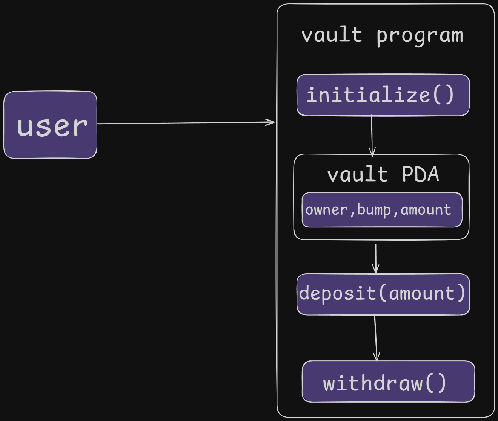

#  Blueshift Anchor Vault

> A secure, decentralized Solana vault program using Anchor — enabling users to deposit and withdraw SOL using deterministic PDAs.

[](https://solana.com/)
[](https://www.anchor-lang.com/)
[](https://www.rust-lang.org/)
[](https://www.typescriptlang.org/)

<div align="center">
  
</div>

## 🎯 Instructions

- ✅ **Initialize Vault:** Creates a PDA-based vault account bound to the user
- ✅ **Deposit SOL:** Sends lamports from the user to the vault with minimum validation
- ✅ **Withdraw SOL:** Recovers all lamports back to the user's wallet
- ✅ **Account Validation:** Uses Anchor's PDA and bump mechanics for security
- ✅ **Error Handling:** Custom error codes for better debugging

### 1️⃣ Clone & Install

```bash
# Clone the repository

git clone https://github.com/0x4nud33p/blueshift_anchor_vault.git

cd blueshift_anchor_vault

```
